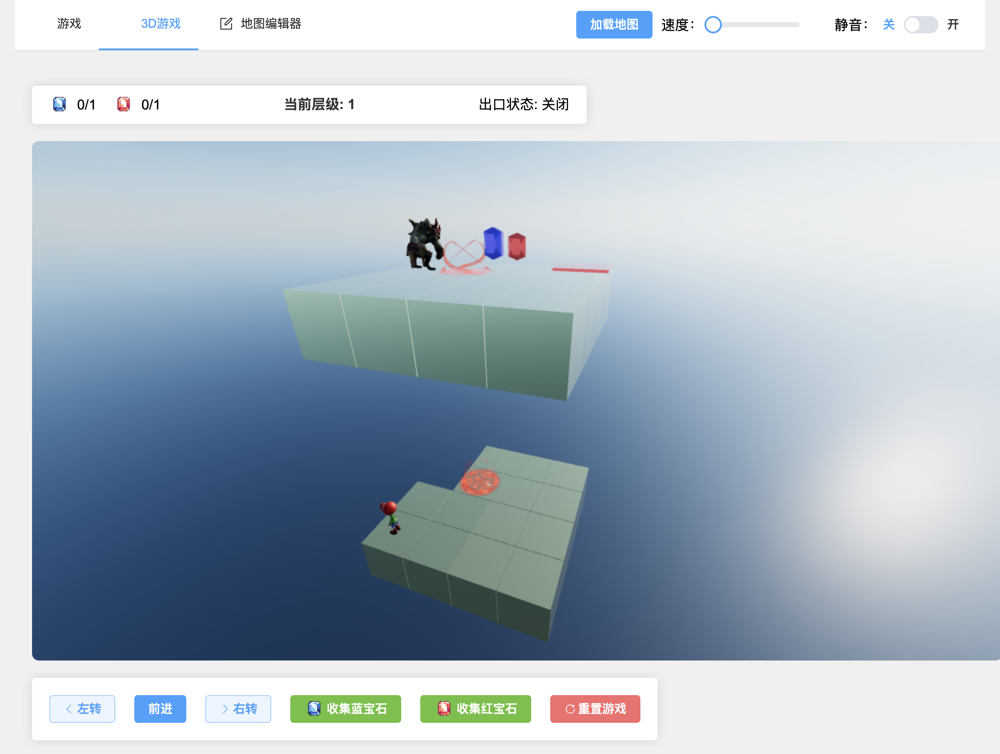
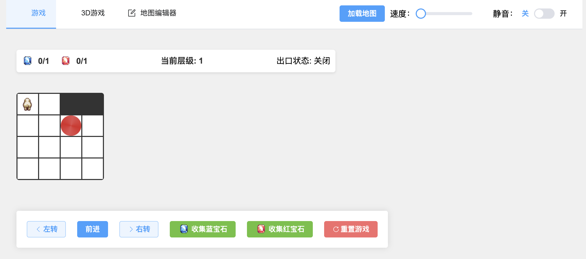
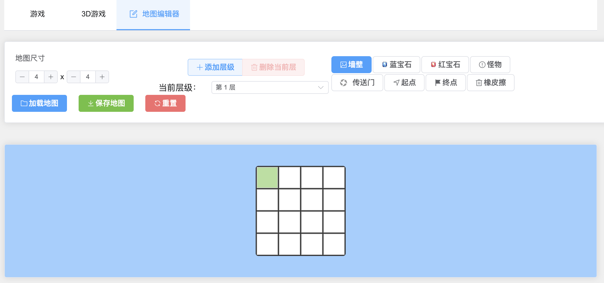

# Python Maze Game - Programming Learning Tool for Youth

A 3D+2D maze game designed specifically for young people to learn Python programming. By writing Python code to control game character movement, learners can master basic Python programming concepts through hands-on practice.

## Application Screenshots

### 3D Game Interface


### 2D Game Interface


### Map Editor


## Features

- 3D maze environment (also supports 2D maze) with multi-level maze structure
- Control character movement through Python code
- Collect gems (blue and red gems)
- Avoid monsters
- Use teleport gates to move between different cells or levels
- Built-in map editor for creating custom mazes

## Installation

1. Ensure Python 3.6 or higher is installed on your computer
2. Install Python dependencies:
```bash
pip install -r requirements.txt
```

## Running the Game

1. Install dependencies
```bash
npm install
```
2. Start the game client:
```bash
npm run electron:dev
```

3. Control the game using Python code:
In the project's `python` directory, use Python code to control the game:

```python
from python.maze_controller import controller

# Move forward
controller.move_forward()

# Turn left
controller.turn_left()

# Turn right
controller.turn_right()

# Collect blue gem
controller.collect_blue_gem()

# Collect red gem
controller.collect_red_gem()

# Reset game
controller.reset_game()
```

## Python API Reference

The game provides the following Python APIs for learners:

- `move_forward()`: Move one step forward
- `turn_left()`: Turn 90 degrees left
- `turn_right()`: Turn 90 degrees right
- `collect_blue_gem()`: Collect blue gem
- `collect_red_gem()`: Collect red gem
- `reset_game()`: Reset the game
- `is_on_blue_gem()`: Check if standing on a blue gem
- `is_on_red_gem()`: Check if standing on a red gem
- `get_game_state()`: Get current game state

## Game Objectives

1. Collect required number of blue and red gems in the maze
2. Avoid monsters
3. Find and reach the exit
4. Use teleport gates to move between different cells or levels

## Programming Learning Points

Through controlling the maze game, learners can master the following Python programming concepts:

- Function calls
- Conditional statements
- Loop structures
- Variable usage
- Logical thinking
- API calls
- JSON data processing

## Developer Tools

The game includes a built-in map editor that allows:

- Creating multi-level mazes
- Setting wall positions
- Placing gems and monsters
- Setting up teleport gates
- Saving and loading map configurations

## System Requirements

- Operating System: Windows/macOS/Linux
- Node.js 14.0 or higher
- Python 3.6 or higher
- Graphics card must support WebGL

## Notes

1. Ensure the game client is running before executing Python control code
2. Wait for animations to complete between each movement or rotation operation
3. Make sure the character is correctly positioned when collecting gems

## License

MIT License 